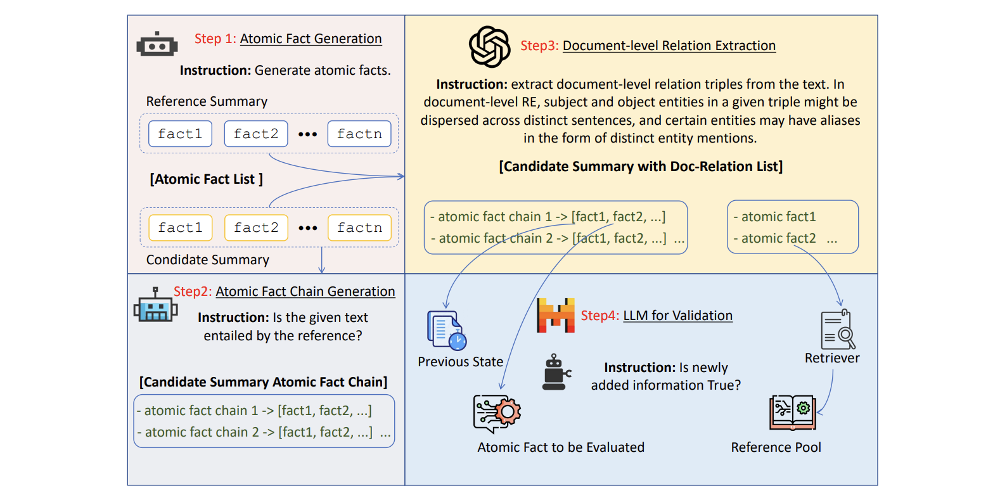








# About me

Hi there! I am a 4th-year undergraduate student at the Beijing University of Posts and Telecommunications (BUPT). I was previously a research assistant at the Knowledge Engineering Group at Tsinghua University, supervised by Prof. [Juanzi Li](https://www.cs.tsinghua.edu.cn/csen/info/1303/4318.htm). I was also a visting student at Westlake University, supervised by Prof. [Yue Zhang](https://frcchang.github.io/). I work closely with Dr. [Ning Ding](https://www.stingning.cn/), Dr. [Ganqu Cui](https://cgq15.github.io/) and Prof. [Bowen Zhou](http://web.ee.tsinghua.edu.cn/zhoubowen/zh_CN/index.htm).

I am going to pursue a Ph.D. in School of Artificial Intelligence at Shanghai Jiao Tong University (SJTU) and Shanghai Artificial Intelligence Laboratory in 2025 under the supervision of Prof. [Zhouhan Lin](https://hantek.github.io/) and Prof. [Bowen Zhou](http://web.ee.tsinghua.edu.cn/zhoubowen/zh_CN/index.htm).

Currently, my interest lies in LLM alignment, and reward model. If you are interested in these topics, feel free to reach out to me!

# News
- *2024.10*: I am joining Shanghai Artificial Intelligence Laboratory as a research intern!
- *2024.07*: I am joining [frontis.ai](https://frontis.ai/) as a research intern!
- *2024.04*: Our two papers are accepted by COLING 2024!
- *2023.09*: I win the National Scholarship (8k RMB) in China!

# Publications ([Full List](https://scholar.google.com/citations?view_op=list_works&hl=en&user=u75E9OsAAAAJ))

<dl>
  <dt>
</dt>
  <dd><a href="https://arxiv.org/abs/2407.04969">
    <strong>EVA-Score: Evaluation of Long-form Summarization on Informativeness through Extraction and Validation
</strong></a></dd>
<dd><strong><u>Yuchen Fan</u></strong>, Xin Zhong, Chengsi Wang, Gaochen Wu, Bowen Zhou</dd>
    <dd><strong>preprint.</strong></dd>
</dl>
 
 
 

---

<dl>
  <dt>
</dt>
  <dd><a href="https://aclanthology.org/2024.lrec-main.567/">
    <strong>Evaluating Generative Language Models in Information Extraction as Subjective Question Correction
</strong></a></dd>
<dd><strong><u>Yuchen Fan</u></strong>, Yantao Liu, Zijun Yao, Jifan Yu, Lei Hou, Juanzi Li</dd>
    <dd><strong> Proceedings of the 2024 Joint International Conference on Computational Linguistics, Language Resources and Evaluation (LREC-COLING 2024) </strong></dd>
</dl>

    
 
 
 
 
 

# Honors and Awards

- *2023.10* National Scholarship

- *2023.01* Provincial Second Prize, National Mathematical Competition for College Students

- *2022.09* First-class Scholarship

# Working Experiences
- *2024.10 - Present*, Shanghai Artificial Intelligence Laboratory, Research Intern.

- *2024.07 - 2024.08*, Frontis.ai, Research Intern.

- *2024.04 - 2024.08*, NLP Group, advised by Prof. [Yue Zhang](https://scholar.google.com/citations?user=6hA7WmUAAAAJ&hl=en), Westlake University.

- *2023.12 - 2024.8*, C3I, advised by Prof. [Bowen Zhou](http://web.ee.tsinghua.edu.cn/zhoubowen/zh_CN/index.htm), Tsinghua University.

- *2022.10 - 2023.10*, KEG, advised by Prof. [Juanzi Li](https://www.cs.tsinghua.edu.cn/csen/info/1303/4318.htm), Tsinghua University.
  

# Academic Services

- Reviewer for ICLR 2025