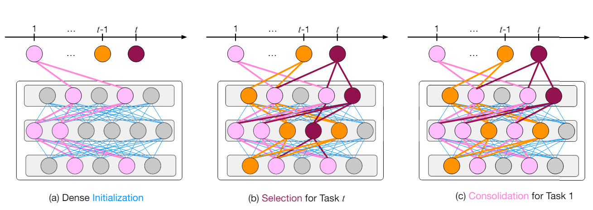
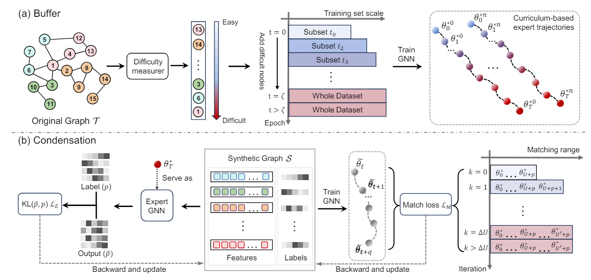








# About me

Hi there! I am a junior undergraduate student at the University of Electronic Science and Technology of China (UESTC) and currently a research assistant at the National University of Singapore (NUS) supervised by Young Presidential Prof. [Yang You](https://www.comp.nus.edu.sg/~youy/). I worked closely with Dr. [Kai Wang](https://kaiwang960112.github.io/) and Prof. [Wei Jin](https://www.cs.emory.edu/~wjin30/).

My research primarily focuses on Efficient Learning (Knowledge Distillation & Model Compression) and Data-centric AI (Dataset Distillation & Data Selection). 
Please feel free to drop me an email if you want to discuss relevant research topics or potential collaborations!

# News
- *2024.05*: [GEOM](https://arxiv.org/abs/2402.05011), the first lossless graph condensation approach was accepted by ICML 2024!
- *2024.05*: Our workshop on [The First Dataset Distillation](https://dd-challenge-main.vercel.app/) got accepted at ECCV 2024 as a half-day workshop!
- *2023.10*: I won the HuaMeng Scholarship (10k RMB) and First-class Scholarship (2k RMB) for the second time!
- *2023.09*: [DSN](https://proceedings.neurips.cc/paper_files/paper/2023/file/d7b3cef7c31b94a4a533db83d01a8882-Paper-Conference.pdf), the first approach achieved positive BWT, was accepted by NeurIPS 2023!

# Selected Publications 

<dl>
  <dt>
</dt>
  <dd><a href="https://proceedings.neurips.cc/paper_files/paper/2023/file/d7b3cef7c31b94a4a533db83d01a8882-Paper-Conference.pdf">
    <strong>Enhancing Knowledge Transfer for Task Incremental Learning with Data-free Subnetwork
</strong></a></dd>
<dd>Qiang Gao, Xiaojun Shan, <strong><u>Yuchen Zhang</u></strong>, Fan Zhou</dd>
    <dd><strong> Advances in Neural Information Processing Systems (NeurIPS), 2023. </strong></dd>
</dl>

 

<dl>
  <dt>
</dt>
  <dd><a href="https://arxiv.org/abs/2402.05011">
    <strong>Navigating Complexity: Toward Lossless Graph Condensation via Expanding Window Matching
</strong></a></dd>
<dd><strong><u>Yuchen Zhang</u></strong>, Tianle Zhang, Kai Wang, Ziyao Guo, Yuxuan Liang, Xavier Bresson, Wei Jin, Yang You</dd>
    <dd><strong>International Conference on Machine Learning (ICML), 2024.</strong></dd>
</dl>
    
 
 

# Honors and Awards

- *2023-10* HuaMeng	scholarship (Award rate: 0.2%) 

- *2023-10* First-class scholarship

- *2023-7*  National second prize, 16th China	Collegiate Computing Competition

- *2023-6*  Provincial first prize, 16th China Collegiate Computing Competition

- *2023-6*  Provincial second Prize, 8-th C4-Network Technology Challenge

- *2023-5*  Provincial second Prize, 13th China National Undergraduate "Innovation, Creativity and Entrepreneurship" Challenge

- *2022-10* First-class scholarship 

- *2022-8*  Best Project Award, 2022 NJU NLP SummerCamp

# Invited Talks
- *2024.05 (public soon)*, "Lossless Graph Condensation" on [Techbeat](www.techbeat.net).

# Working Experience
- *2022.10 - 2023.6*, ICDM Lab, advised by Prof. [Fan Zhou](https://scholar.google.com/citations?user=Ihj2Rw8AAAAJ&hl=zh-CN), UESTC.
- *2023.6-present*, HPC-AI Lab, advised by Prof. [Yang You](https://www.comp.nus.edu.sg/~youy/), NUS
  
# Academic Service
- Chair of ECCV'24 Workshop: The First Dataset Distillation Challenge

